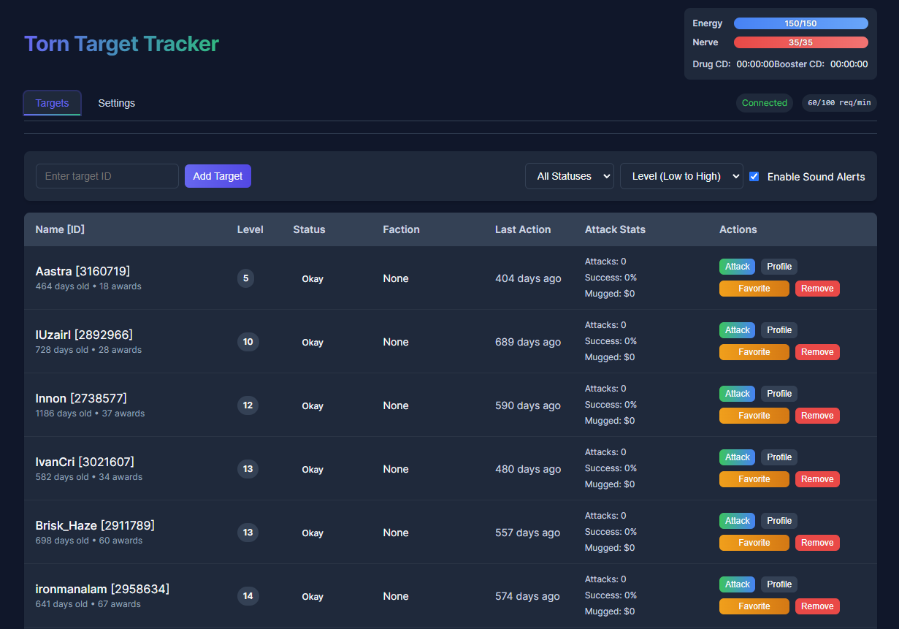
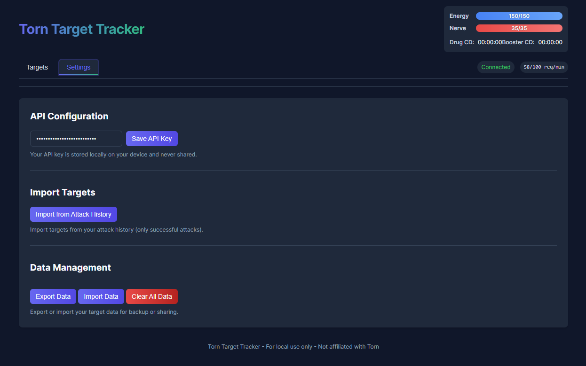

# Torn Target Tracker

A local web application for tracking and managing targets in Torn.

## Features

- **Target Management**
  - Add targets by ID
  - Import targets from your attack history
  - Favorite important targets to keep them at the top of the list
  - View detailed information about each target (level, status, faction, etc.)
  - Track attack statistics (attacks, success rate, money mugged)

- **Chain Management**
  - Monitor current chain count and cooldown timer
  - Track energy and nerve levels with visual progress bars
  - Monitor drug and booster cooldowns

- **Real-time Updates**
  - Dynamic automatic update rate based on number of targets
  - Status indicators show when targets come online or leave the hospital
  - Sound alerts for important events (configurable)

- **Data Management**
  - Export/import your target data for backup or sharing
  - All data stored locally on your device
  - No server-side components, fully client-side

## Setup Instructions

1. **Download the Files**
   - Click the green <Code> button and select "Download ZIP"
   - Unzip the download and open the folder.

2. **Run the Application**
   - Open `index.html` in a web browser

3. **API Key**
   - Go to the Settings tab
   - Enter your Torn API key (needs public, user, and faction access)
   - Click "Save API Key"

## How to Use

### Adding Targets

- **Manual Entry**: Enter a player ID in the "Enter target ID" field and click "Add Target"
- **Bulk Import**: Go to Settings tab and click "Import from Attack History" to import targets from your successful attacks

### Managing Targets

- **Sort/Filter**: Use the dropdown menus to sort and filter your targets
- **Favorite**: Click the "Favorite" button to pin important targets to the top of the list
- **Attack**: Click the "Attack" button to open a new tab with the attack page for that target
- **Profile**: View a target's profile page on Torn
- **Remove**: Remove targets you no longer want to track

### Chain Management

- Monitor your current chain count and countdown timer
- Track your energy for planning attacks
- See drug and booster cooldowns to plan energy replenishment

## Permissions

The application requires these API permissions:
- **public**: For basic player information
- **user**: For your energy, nerve, and cooldown information
- **faction**: For chain information

## Privacy and Security

- Your API key is stored only on your local device
- No data is sent to any external servers other than the official Torn API
- All target information is stored in your browser's local storage

## Troubleshooting

- **API Key Errors**: Ensure your API key has the correct permissions
- **Empty Energy/Nerve Bars**: Try refreshing the page or clicking "Update Chain Status"
- **Missing Targets**: Go to Settings tab and click "Import from Attack History"
- **CORS Errors**: If running locally, you may need to use a CORS-enabled browser or extension

## Limitations

- Due to Torn API rate limits, adding many targets at once may take some time
- API key permissions determine what information can be displayed

## Credits

- Developed by BeauMcSwain

